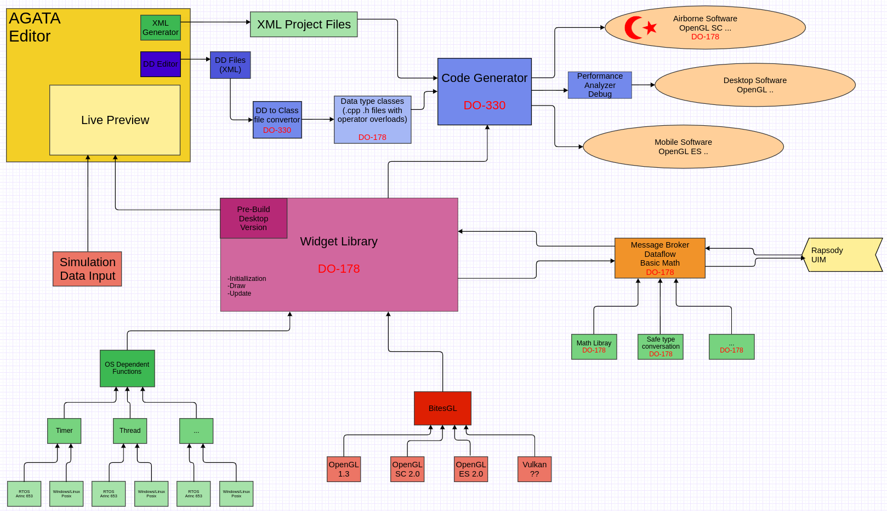

[

# Proof of Concept
A simple POC program for D0-178 certifiable HMI creator.

- Dot 
- Line
- Circle 
- Rectangle
- Simple Group
- Message Broker

 # Development Environment
 - CMake
 - C++ 2017
 - OpenGL
